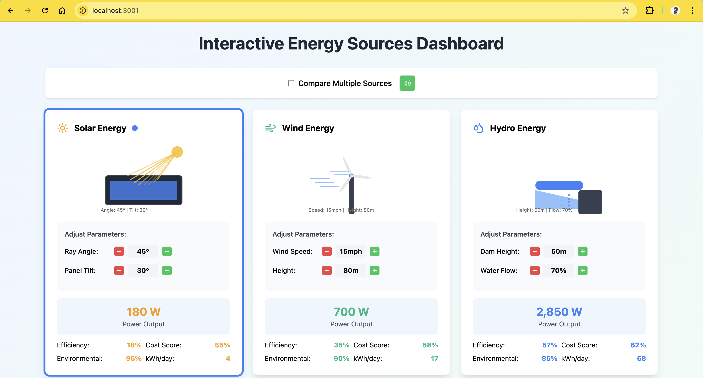
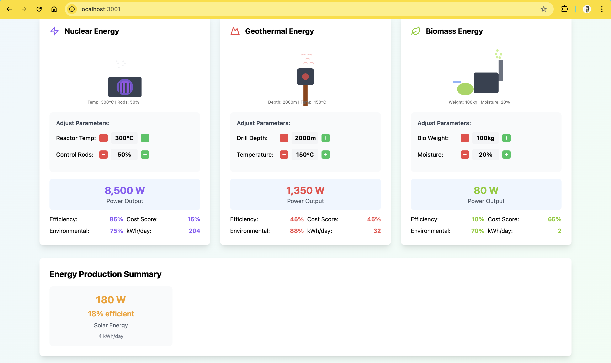
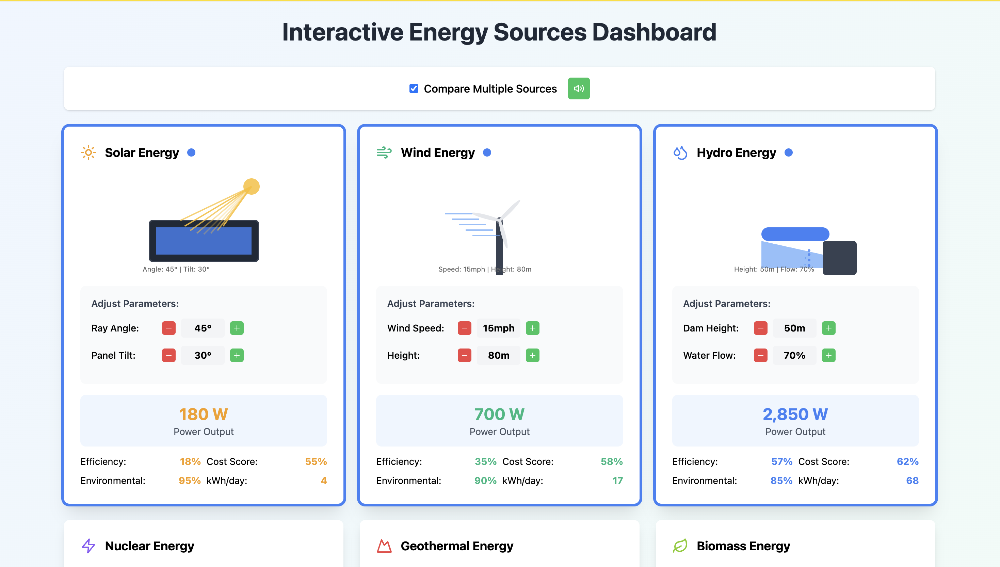
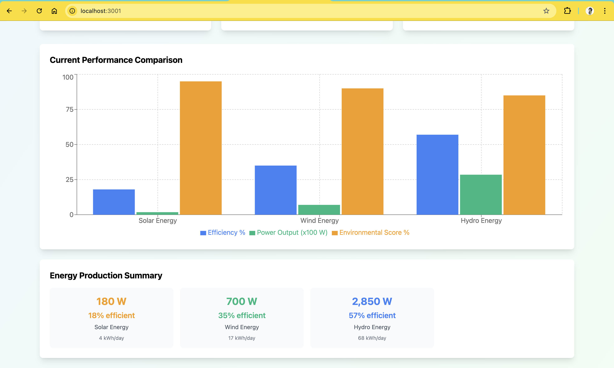
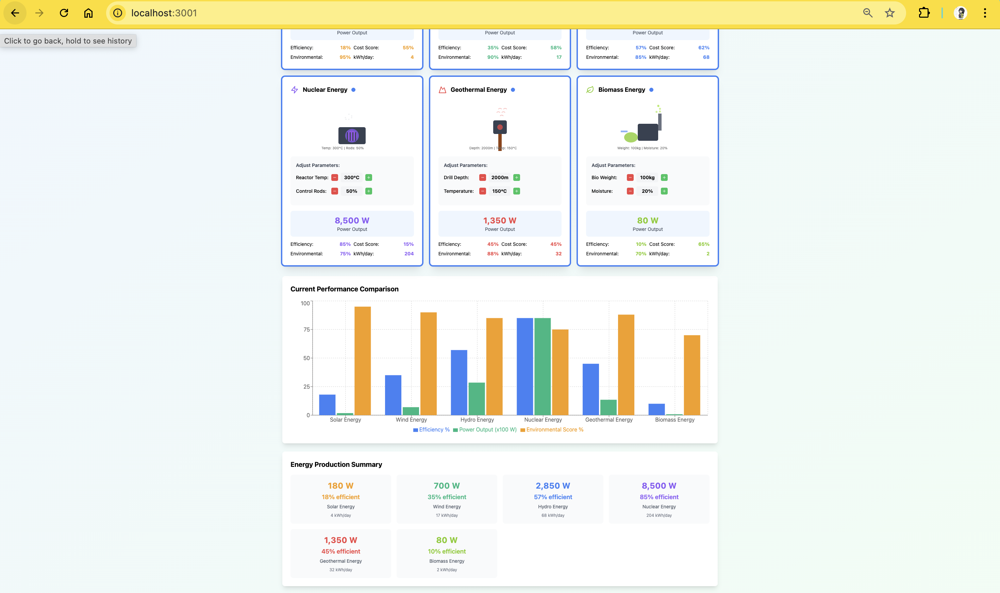

# Renewable Energy Simulation

An interactive dashboard for comparing different renewable energy sources. Visualize, compare, and analyze energy data with modern charts and a user-friendly interface.

-## Features
- Compare multiple renewable energy sources (solar, wind, hydro, etc.)
- Visual charts and statistics using Recharts
- Adjustable parameters for each energy source
- Responsive and modern UI


## Screenshots

### Dashboard Views



### Comparison Views




## Getting Started

### Prerequisites
- Node.js (v18 or higher recommended)
- npm (comes with Node.js)

### Installation
1. Clone the repository:
	```sh
	git clone https://github.com/arkham-knight07/Renewable-Energy-Simulation.git
	cd Renewable-Energy-Simulation
	```
2. Install dependencies:
	```sh
	npm install
	```
3. Start the development server:
	```sh
	npm start
	```
4. Open your browser and go to `http://localhost:3000`

## Deployment
You can deploy this app for free using platforms like Vercel, Netlify, or GitHub Pages.

## License
This project is licensed under the MIT License.
